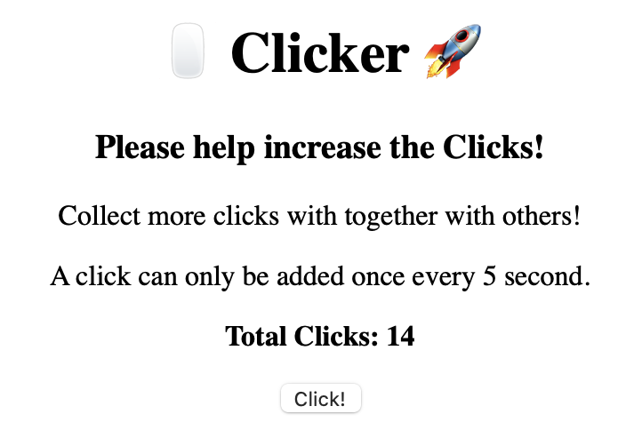
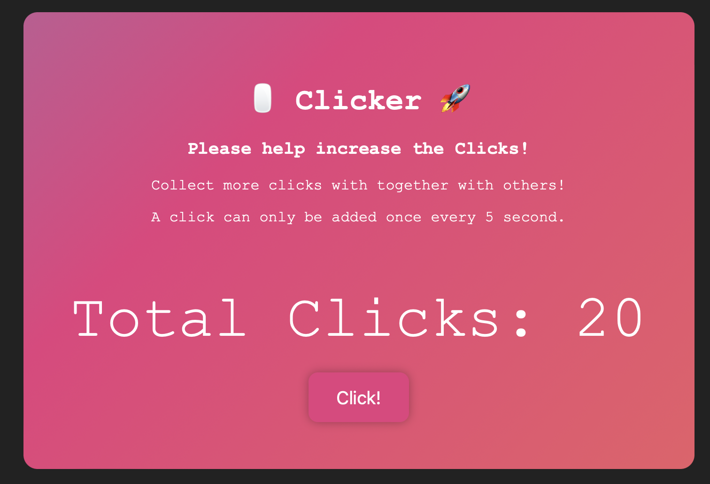
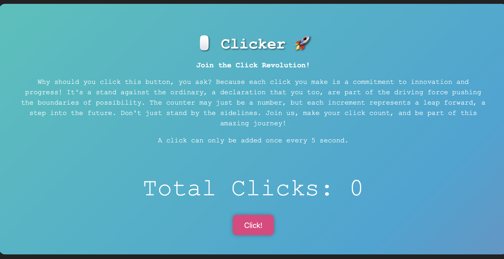

# Clicky
You can try it [here](https://ad-ops.shuttleapp.rs/web).

I wanted to use the [Shuttle Persist](https://docs.shuttle.rs/resources/shuttle-persist) so I thought I could do something like [Cow Clicker](https://en.wikipedia.org/wiki/Cow_Clicker) which stores state for everyone.

## Concurrent backend
Since I didn't want to handle issues with concurrency from multiple users or instances I decided to put a global timeout of 5 seconds at the backend.

## Problems with nitial and future values in Dioxus
On big problem I had in Dioxus (frontend) was to load the data when you go to the site and then when clicking get the updated value.

Dioxus has a concept of `use_futures` for values load at start and spawns for asyncronous calls which I used when the button was clicked. The problem was that the `add_clicks` function sets a `use_state` variable, but could not set the future-variable becuase of lifetime issues. I tried to make a few different versions and the best one I could come up with was to call a `get_clicks`-function before rendering, but this will go into an infinit loop.

I will try to resolve it in future version and just initiate it as `0` for now.

## Multiple Dioxus components and Routing
Breaking up all components into their own files and adding a `Router` makes it much more easy to organize the code.

Since I am not a frontend developer of course I fell for the meme of centering the body, but not the navbar🙃. 

Right now the routing does not update the browser navigation which is something needed to look into.

## Improving UI with ChatGPT
This is the first version.



Part of this experiment is to test tools to build prototypes. This also means things like ChatGPT which I believe is a very good fit for testing new ideas.

So from the prompt: 

```
Create css for a demo which is a button where you press it increases a count. Make the style stand out and be a bit crazy since this is a innovation demo
```

It created the second version. The only difference I did was to make the gradient effect a bit slower, because it was to annoying.



```
Add a sales-pitch on why everyone should be part in clicking this button.
```

Updated to the description and some minor style changes.

